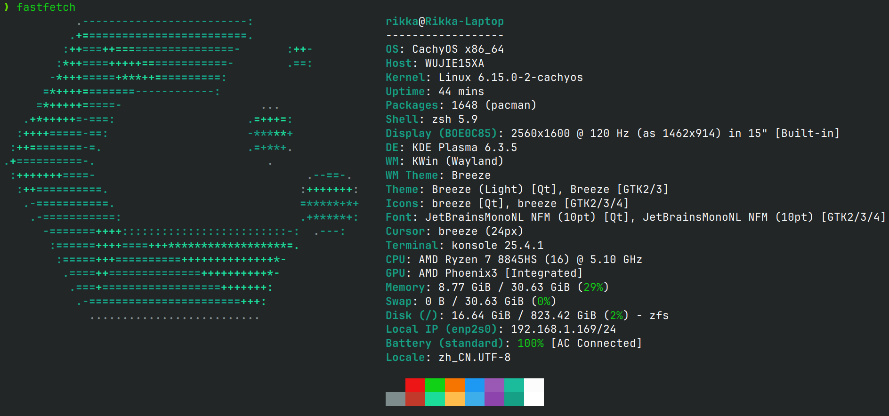

## 好耶

总之就是，换新电脑了  
国补完 3998 到手  
以前的那台零刻 SER5 MAX 虽然说确实有一定的便携性，但还是不怎么方便（便携屏+键盘），而且在外面组好这套有点太显眼了x，于是卖掉了  

## 参数
懒得列了，就补充些别的评测没有的吧  
后面的 USB4 是 40Gbps 的，插上雷电三控制器可以识别，暂时没有 PCIe 设备进行测试  
面板是京东方的，**据说**存在坏点问题，我手上这台正常  
机子自带的硬盘是英睿达的 P3 Plus  
有线网卡是 Motorcomm YT6801（要注意这个网卡的驱动截至目前尚未进入 Linux 主线，安装时需要使用 Wi-Fi 或手机共享）  
无线网卡是 MediaTek MT7922

## 使用体验
太棒了！~~（孩子词穷真的想不到什么更好的形容词了）~~  
性能真的好到不像一个轻薄本，真的满足了我到处跑还能打游戏的幻想  
键盘手感尚可，就是很普通的笔记本上的薄膜，平平无奇。但是它的全尺寸方向键和数字小键盘真的直接戳中我了，不过代价就是键盘边缘十分贴近 C 面边缘以及方向键是突出去的（强迫症患者可能会不适），见仁见智吧  
屏幕可以单手开合，但是转轴并不是很稳定，移动时会前后晃  

To do

## 性能
以下性能均为电源接通时测试  

To do

### 理论性能

#### Sysbench
单线程：5660  
16 线程：47163

#### CPU-Z
单线程：706  
多线程：7256

### 游戏性能

#### 地平线 4
2560x1600，预设高，基准测试全程 60FPS，游戏时显卡占用约为 85-98%  
（它比 Tesla M40 还要强诶！）

#### Minecraft
这不是闭着眼跑吗x  
在 1.20 下锁 120 帧时 GPU 占用约在 30%-40%，在雨林的复杂地形最高 50%

## 踩坑

1. 上面说过的网卡在 Linux 没驱动（Arch Linux 可以用 [tuxedo-yt6801-dkms-git](https://aur.archlinux.org/packages/tuxedo-yt6801-dkms-git)，其他系统可在官网下载安装）