大量图片注意！不过已经压缩并转换为 WebP，可放心流量）

## 海南-海口 Day0

一直都想坐的，这次终于有机会了！  
7.15 晚上 21:22 乘坐 Z114 次从广州白云出发，经过越四个半小时到达湛江西，然后前往徐闻的渡口进行解挂登船  
到湛江西的时候实在是太困了，没能亲眼看到  
不过设了闹钟，早上起来的的时候刚好准备靠岸  
负责调车的机车是 DF4DD  
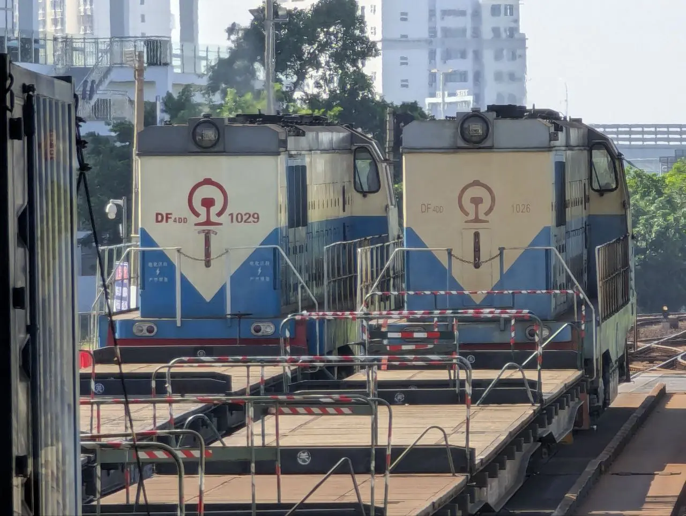  

到了海口站换乘 S8059 次前往海口东（第一次做市郊铁路诶！）  
是特别涂装的 CRH6F-A，超漂亮！  
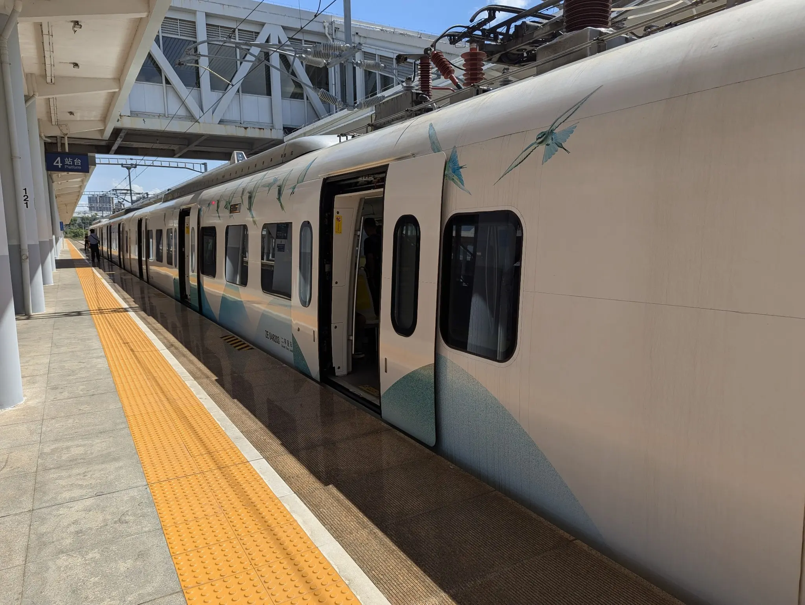  

参观了一下海南省博物馆，简单逛了一下（热死了呜呜呜），回程从城西站搭乘 S8040 返回海口站，又遇到了不同涂装的 CRH6F-A  
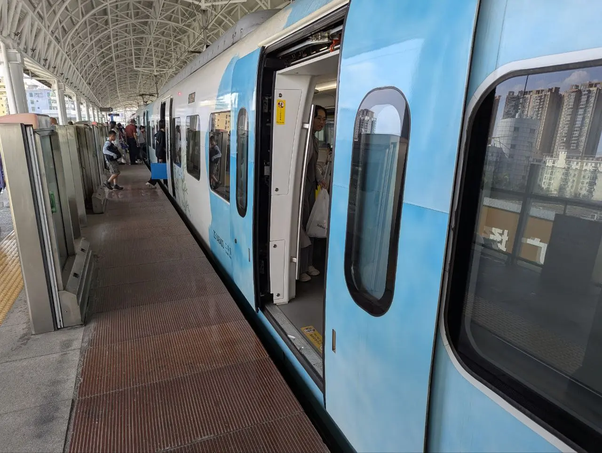    
不知道为什么感觉海南和广东其实也没什么区别）

回程没什么特别的，乘坐 K512 次返回广州白云，没想到渡轮只需要一个小时就到了  

碎碎念：再也不想坐 25G 了！和 25Z 的体验完全不同，超级烂

## 云南-普者黑 Day1-Day2

7.19 早上 9:30 在广州南乘坐 D3822 次前往普者黑站  
整整七个小时，第一次坐这么久的列车  
到了之后放好行李，吃了云南的第一餐饭  
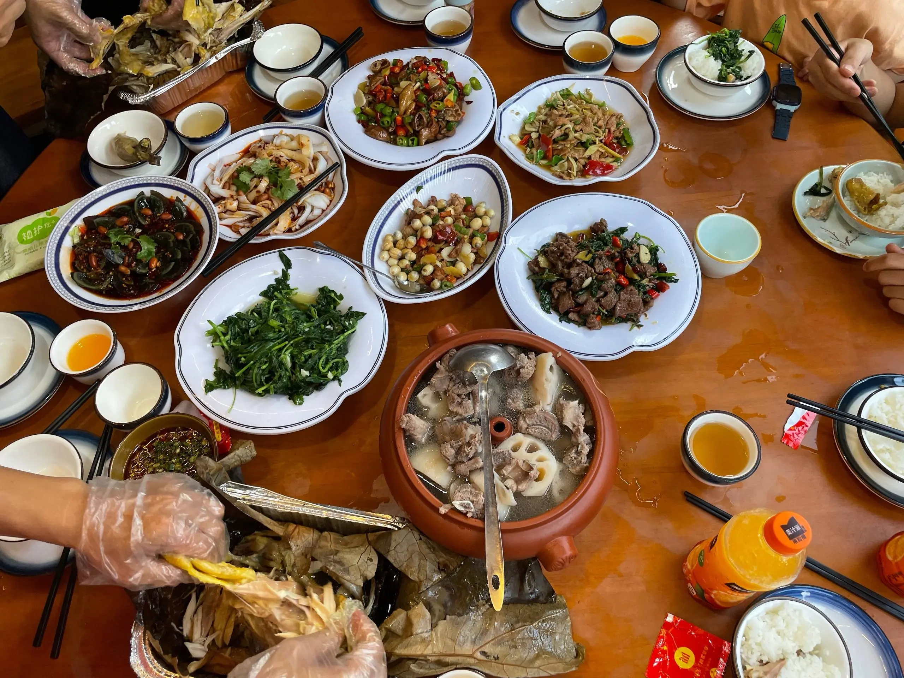  
对我而言吃不太习惯呢，这边的调味跟广东完全不一样  

第二天，爬了青龙山，喀斯特地貌的风景超漂亮的，湖水是像果冻一样的质感  
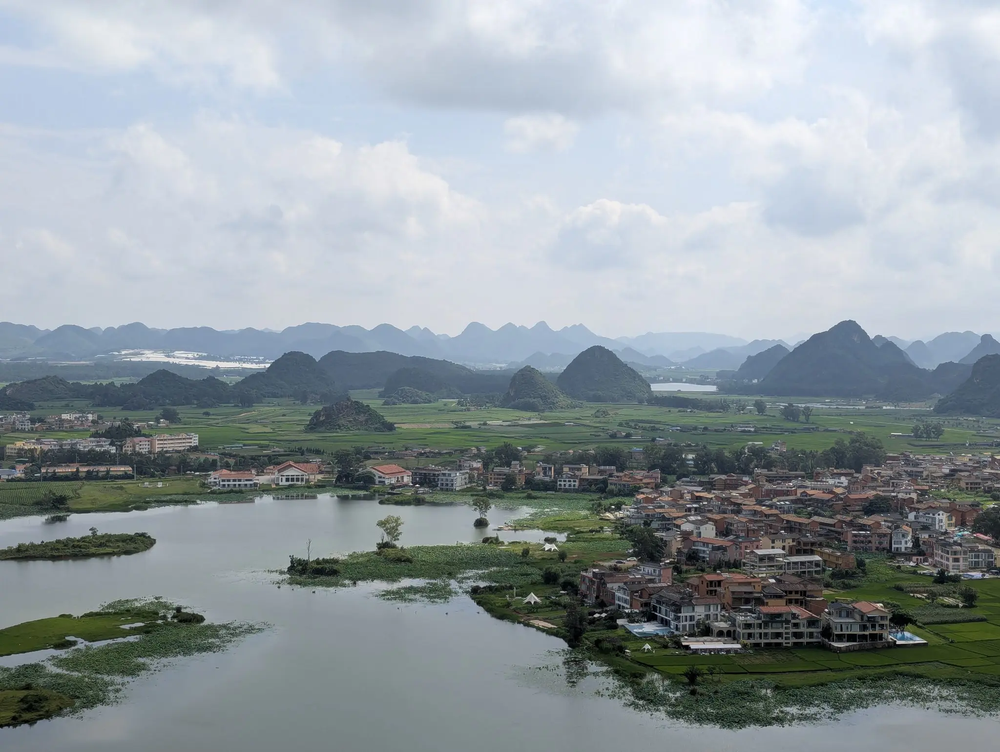  
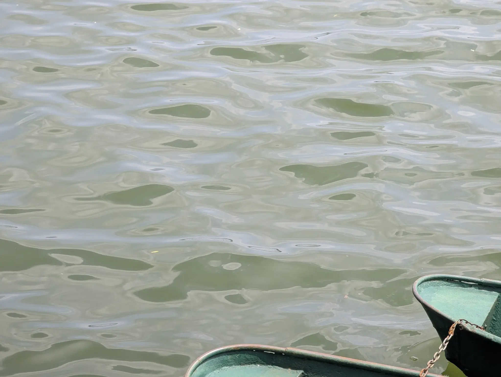  
感觉跟之前去的广西差不多（小声  

然后没什么好拍的，拿长焦去拍了好多花）
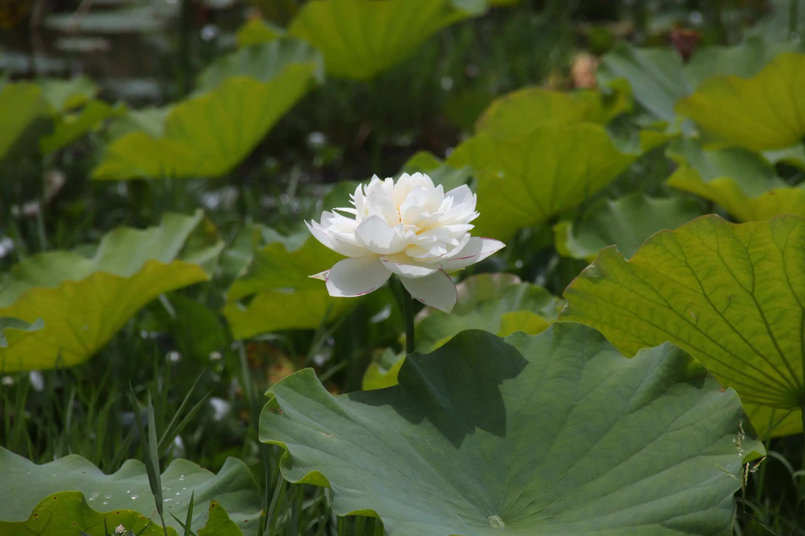  
  

晚上吃了顿烧烤，睡觉  
普者黑完

## 云南-弥勒 Day3-Day4

7.21 10:46 从普者黑站出发，乘坐 D9851 前往弥勒  
（昆局的英语广播是英式英语，超好听）  
放好东西之后就去沙滩玩  
嗯，是沙滩，在高原上的沙滩  
小朋友们玩得很开心，不过 Rikka 不是很能 participate in，只是在一旁默默拍照  
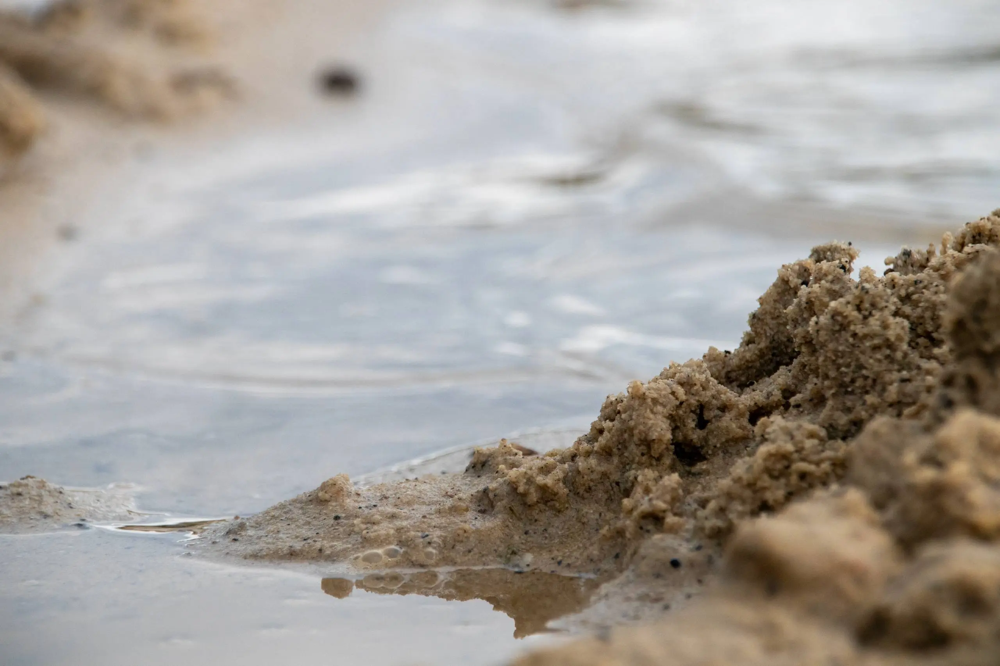  
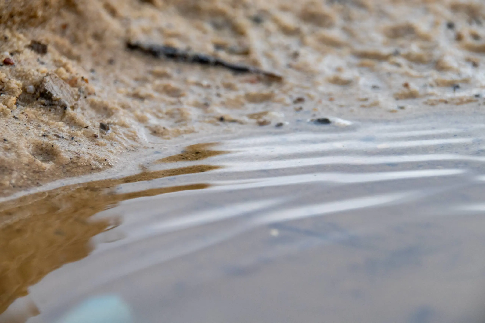  
（还是微距好用，随手拍都能出片  

晚上吃了菌子煲…………说真的至少对 Rikka 而言不是很好吃  
汤并不鲜，只有一股菌子特有的奇怪的味道  
菌子口感千奇百怪，有煮融了的有脆的有软的，而且味道感觉还不如香菇  
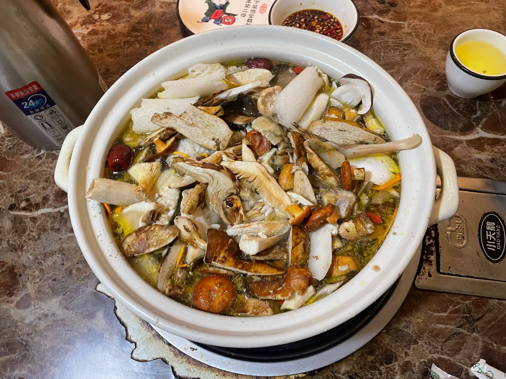  
~~有这钱还不如去吃海鲜呢~~  

第二天，东风韵景区  
这边的花海超好看的！  
有好多一大团的绣球花和小颗小颗的马缨丹  
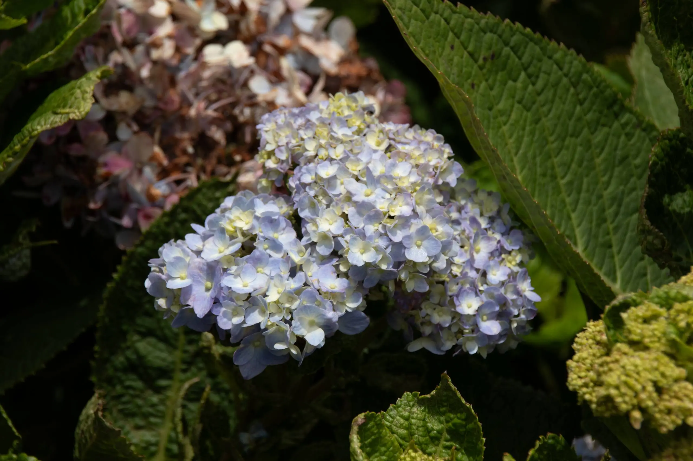  
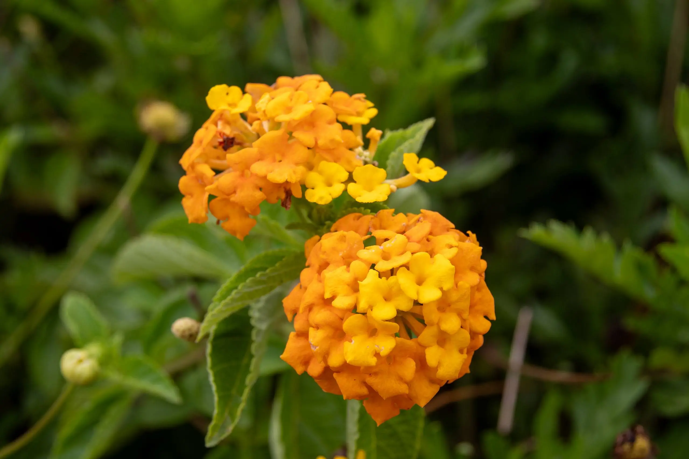
其它的细节已经想不起来了，弥勒结束

## 云南-澄江/昆明 Day5-7

到我写这部分（8.17）已经很难想起具体的内容了，也没有留下很多照片，所以简单写一下

7.23 到澄江，中午吃的石锅鱼，感觉很鲜，很奇怪的鲜，和普通的鱼汤很不一样，鱼肉完全融进汤里的感觉

放好行李先去了云南自博馆  
感觉自然博物馆对我而言不如人文博物馆好逛，只是稍微看了一下就找个地方休息了  
然后在抚仙湖边逛了下沙滩，毕竟小孩子们真的很喜欢）

7.24 沙滩……以及游船

7.25 到昆明，参观了一下西南联大，然后意外发现昆明地铁单程票有超级多款式  
~~于是不小心花了 30 多去抽卡~~
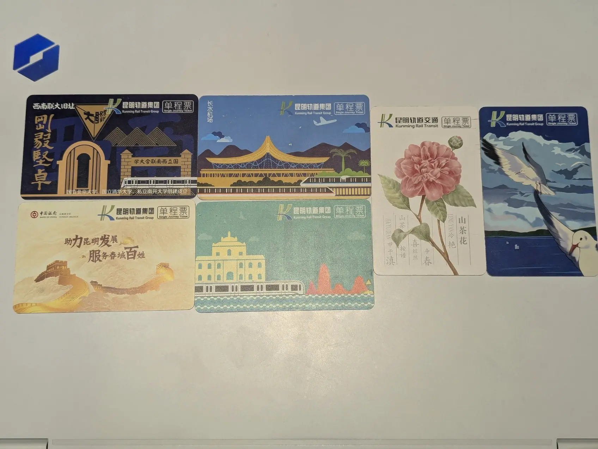

第二天，KMG，CZ3494，落地 CAN  
（顺带一提南航的飞机餐超级恶心